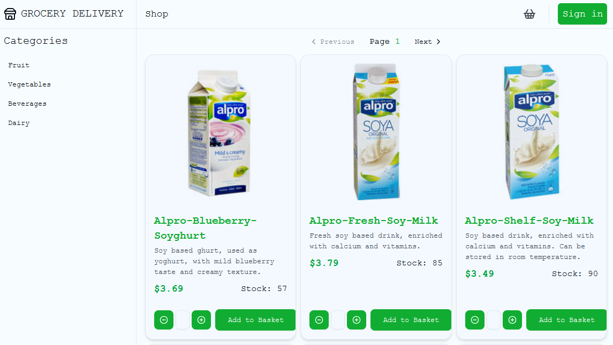

# SPAC - Week 10 & 11 - GroceryDelivery



## Description
This project is a group collaboration between __Thyge123, EmilSalomonsen and PeterHHartmann__.
This repository contains the contents of a 2 week group project at Specialisterne Academy for week 10 and 11. 

The project is an exercise on planning, collaborating and developing on a full stack application of choice.  

For this project, as the name suggests, we chose to create a webshop, where customers can browse, select and order groceries they want to purchase and have delivered to their door.  

## Disclaimer
This project is in no way meant to be production ready or deployed. It is merely an exercise in collaborative development on full stack application.

## Contents
This repository functions as a mono-repo containing multiple elements of the overall application. Those elements include:
- __Backend: C# REST API__ 
   - Written using __ASP.NET Core__ and __Entity Framework Core__
   - serving and managing application data such as products, orders, customers and staff.
- __Frontend: React SPA__ 
   - Written using __React, TypeScript, Vite__.
   - Serving a public facing shop for customers, as well as an administrator CMS dashboard for managing data of the application.  
   - Other tools of note: __@tanstack/react-query, shadcn/ui__
- __Database: PostgreSQL__
   - For persisting data used by the application.

## Development Dependencies
- [Docker](https://www.docker.com/get-started/)
- [.NET SDK 8.0 & ASP.NET Core Runtime 8.0](https://dotnet.microsoft.com/en-us/download/dotnet/8.0)
- [Node.js v22.15.0 or higher](https://nodejs.org/en/download)

## Geting Started
To use the application ensure that all these elements of the application are installed and running:

### Database:
1. Ensure docker is installed and that the docker daemon is running.  
*Getting the daemon running depends on the your environment. On Windows machines it's usually done by starting the Docker Desktop application*
2. Initialize the database. From a terminal in the project root:
```sh
docker compose up --detach
```

### Backend / API
1. From a terminal of choice change to the directory of the API project:
```sh
cd GroceryDeliveryAPI
```
2. Start the .NET application:
```sh
dotnet run .
```
3. The API should now be up and running. The documentation for the API documention is served [here](http://127.0.0.1:5054/swagger/index.html)

### Frontend / Client
1. From a terminal change to the directory of the client project:
```sh
cd GroceryDeliveryClient
```
2. Install requirements:
```sh
npm install
```
3. Start the application:
```
npm run dev
```
4. You should now be able to view client in your browser on [here](http://127.0.0.1:5173/)